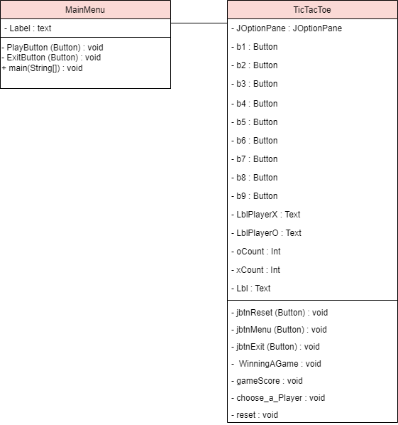

# Tic Tac Toe
This repository is a final project (Java GUI) from Object-Oriented Programming Class, Teknik Informatika Universitas Padjadjaran. 

[Challenge Guidelines](challenge-guideline.md)

Tic-tac-toe adalah permainan kertas dan pensil untuk dua pemain, X dan O, yang bergiliran menandai ruang dalam grid 3 × 3. Pemain yang berhasil menempatkan tiga tanda mereka di baris horisontal, vertikal, atau diagonal memenangkan pertandingan.

## Credits
| NPM           | Name                   |
| ------------- |------------------------|
| 140810200004  | Aulia Rahmanita        |
| 140810200014  | Nawang Ilmi Adzani     |
| 140810200058  | Amariel Danendra Dagna |

## Change log
- **[Sprint Planning](changelog/sprint-planning.md) - (23/11/2021)** 
   - Perencanaan pembuatan game
   - Perencanaan changelog
   - Penambahan challenge guideline

- **[Sprint 1](changelog/sprint-1.md) - (17/11/2021 - 23/11/2021)** 
   - Inisiasi Project 
   - Implementasi OOP
   - Implementasi UI

- **[Sprint 2](changelog/sprint-2.md) - (24/11/2021 - 30/11/2021)** 
   - Implementasi Gameplay (OOP + UI)
   - Implementasi Menu 
   - Implementasi Reset Button & Main 
   
- **[Sprint 3](changelog/sprint-3.md) - (01/12/2021 - 07/12/2021)** 
   - Implementasi Error Handling
   - Implementasi Challenge
   - Finishing

## Running The App

TO;DO with steps

## Classes Used

1. **MainMenu** - `MainMenu.java`
   - Menu awal berisi dua pilihan, yaitu PLAY atau EXIT
      
2. **TicTacToe** - `TicTacToe.java`
   - Berisi logika-logika yang digunakan dalam game TicTacToe
   

## Notable Assumption and Design App Details

- Pemain mengisi kotak permainan berukuran 3 x 3, dimana pemain X akan memulai permainan terlebih dahulu
- Pemain dinyatakan menang jika berhasil membentuk 1 garis dengan huruf/bentuk yang sama, baik berupa garis horizontal, vertikal, maupun diagonal.
- Kemenangan ditandai dengan mengubah warna background kotak/grid yang berhasil membentuk sebuah garis dan akan muncul notifikasi kemenangan. Setelah itu kotak permainan akan otomatis ter-reset/terbersihkan.
- Jika kotak permainan sudah terisi penuh dan tidak ada satupun garis yang terbentuk, maka pemain dapat menekan tombol Reset secara manual untuk membersikan kotak permainan.
- Terdapat Papan Score Kemenangan baik dari Pemain X maupun Pemain O.
- Terdapat Tombol Menu untuk kembali ke Main Menu dan Tombol Exit untuk mengakhiri dan keluar dari permainan.

